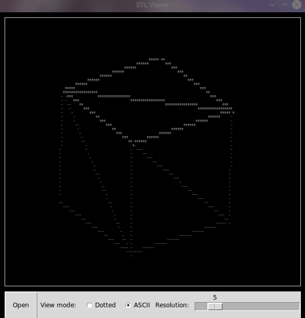
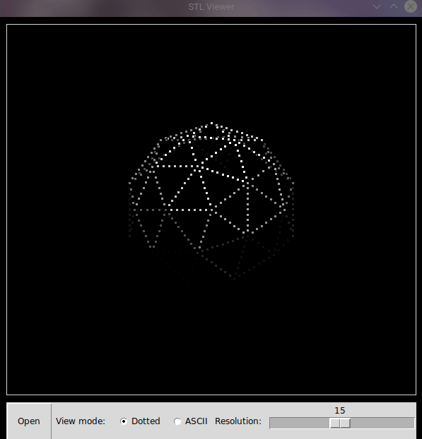
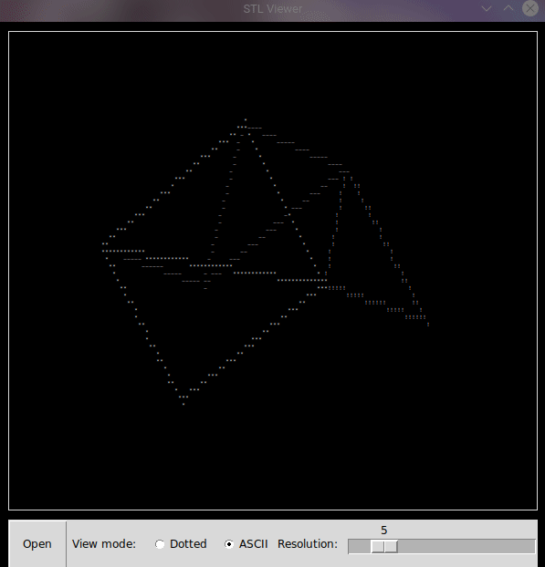
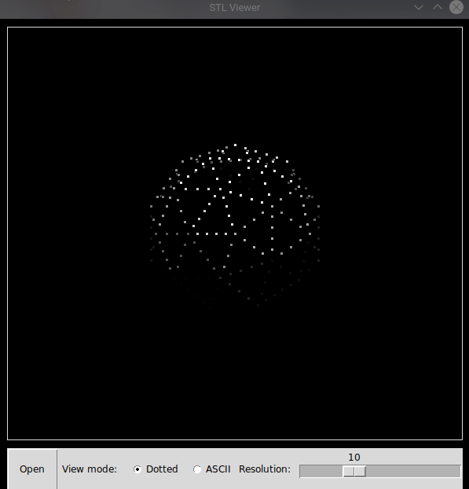

# STL Viewer

This app is a simple STL viewer that displays 3D objects contained in STL files. However, unlike other STL viewer, this app renders objects using two distinct styles:

- dotted style - displays object's wireframe using evenly spaced dots
- ASCII style (inspired by Andy Sloane's [idea](https://www.a1k0n.net/2011/07/20/donut-math.html)) - displays object's wireframe using ASCII characters

In its functionality this app is quite similar to traditional STL viewers. Displayed object can be rotated, moved on the screen and zoomed in and out by using key shortcuts. STL files can be loaded using native file selector, and to increase FPS one can change the resolution (that is how many details to render) of the object.

## Installation

Run the following command to install required modules:
```
pip install -r requirements.txt
```

## Usage

To start the application use run.sh script.

To load STL file use "Open" button and select the desired file. Upon file loading, you can use the buttons at the bottom of the app to change render mode and resolution.

Transformations to the object can be applies using the following key shorcuts:

- Movement - Left click + Mouse move
  <p float="left">
    
     
  </p>
- Rotation - Shift + Left click + Mouse move
  <p float="left">
    
     
  </p>
- Zoom - Mouse scroll
  <p float="left">
    
     
  </p>

  
## Gallery

<p float="left">
  
   *
</p>

-------------------------------------------
<sup>*</sup> Pikachu model created by [flowalistik](https://www.thingiverse.com/flowalistik/designs)
